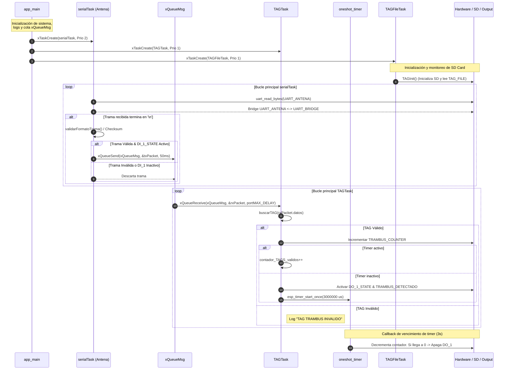
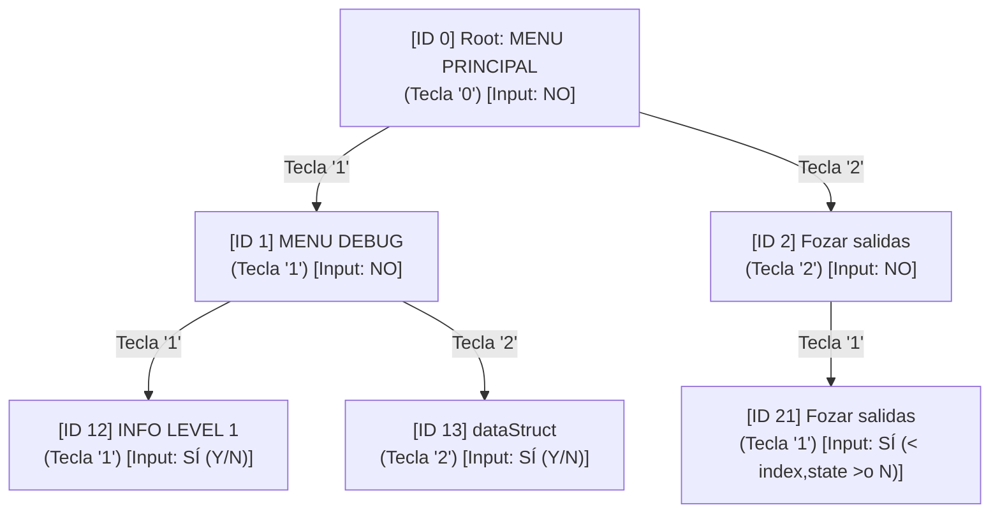
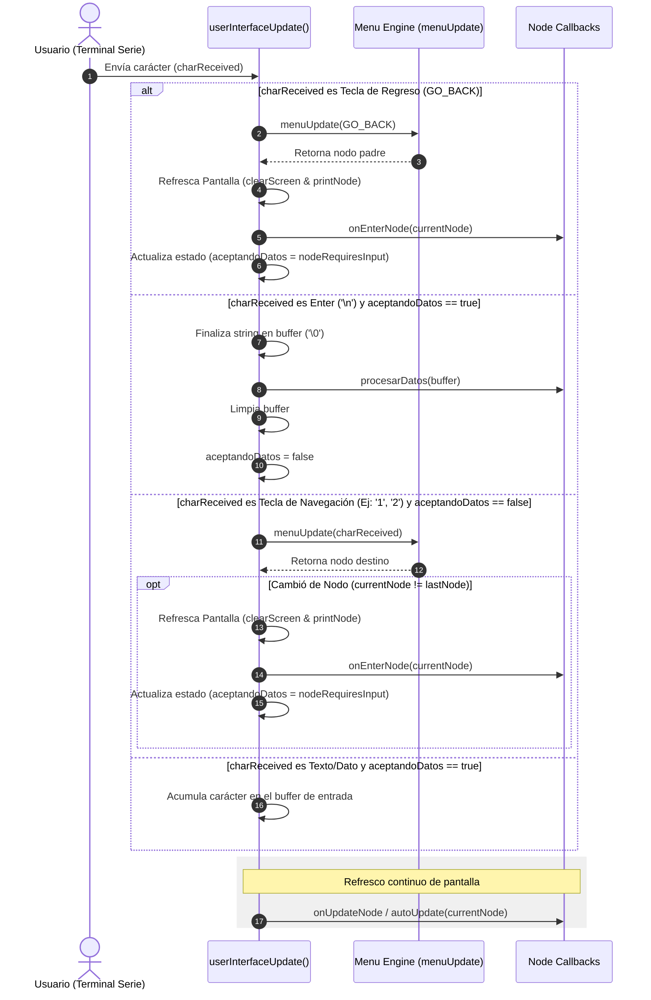

Si se envian mas de SIZE_PAYLOAD -1 el buffer de la uart sufre un overflow lo que descarta todos los caracteres 
recividos hasta ese momento.

## Diagrama de Secuencia de Tareas 

## Menu de usuario

