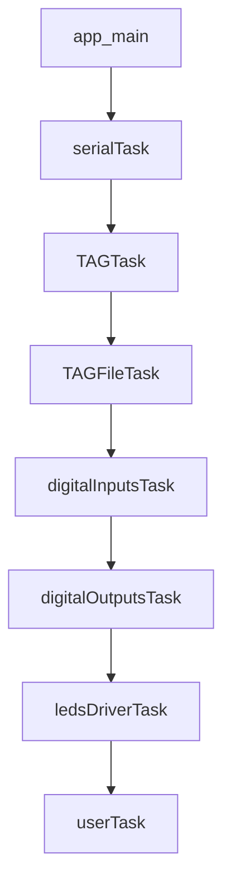

Si se envian mas de SIZE_PAYLOAD -1 el buffer de la uart sufre un overflow lo que descarta todos los caracteres 
recividos hasta ese momento.

```mermaid
flowchart TD

    A[app_main]
    A --> B[serialTask]
    B --> C[TAGTask]
    C --> D[TAGFileTask]
    D --> E[digitalInputsTask]
    E --> F[digitalOutputsTask]
    F --> G[ledsDriverTask]
    G --> H[userTask]
```

```mermaid
flowchart LR

    A[serialTask] --> B[xQueueMsg]
    B --> C[TAGTask]
```

